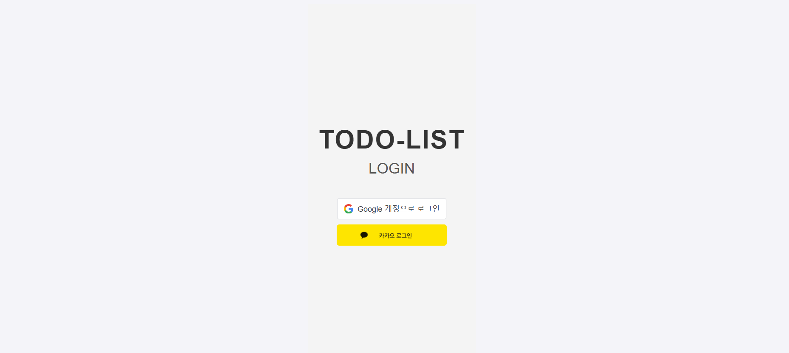
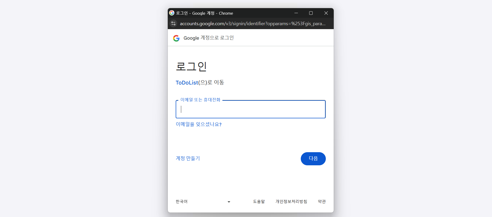
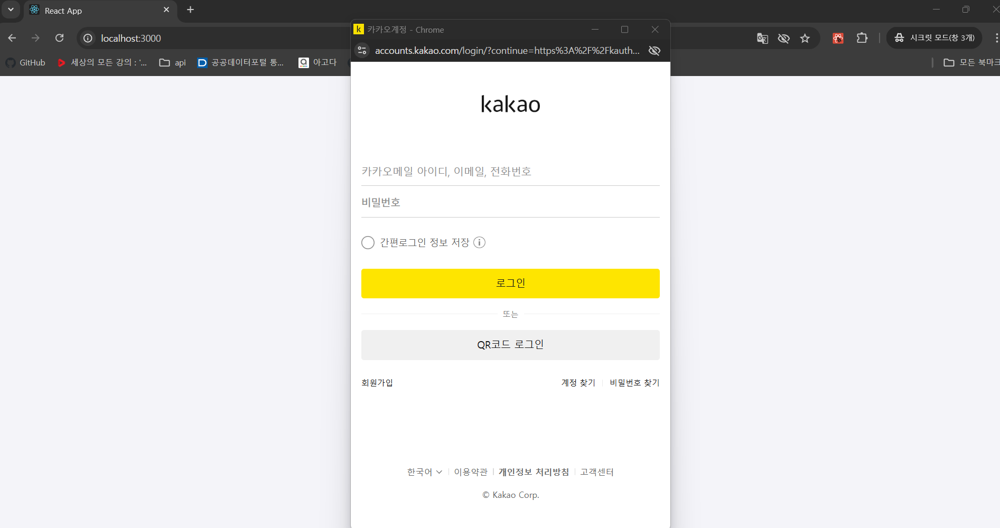
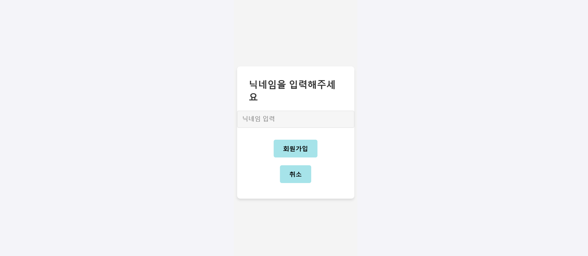
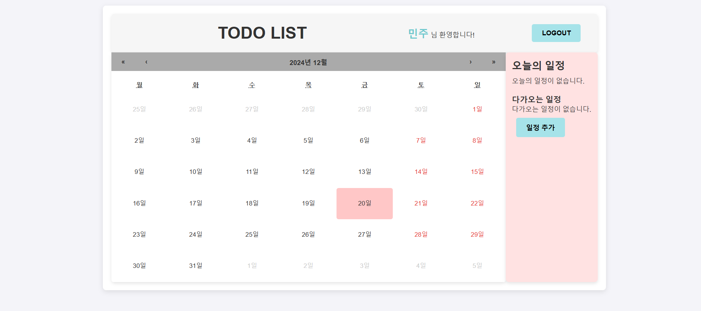
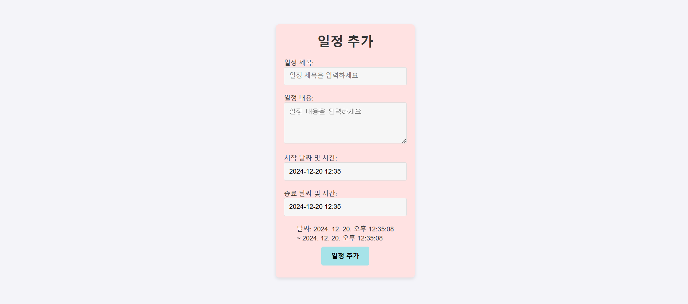
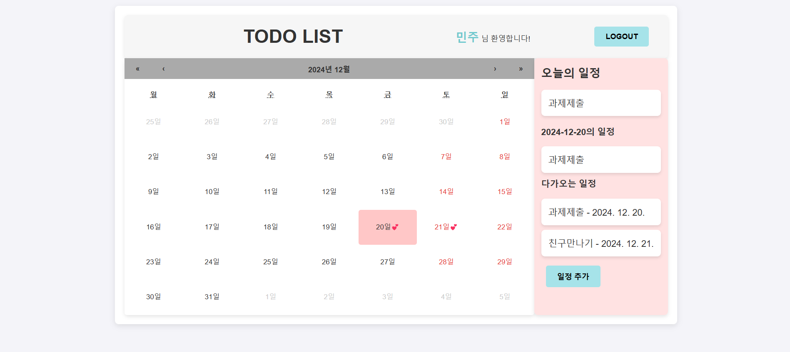
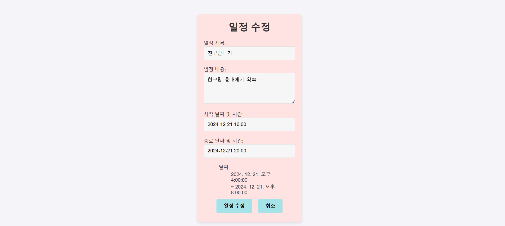

# todolist_front
## TODO 앱 화면
**개발기간** : 2024-12-10 ~ 2024-12-20

## 📢 프로젝트 소개
- 기본적인 TODO 어플리케이션의 화면입니다.
- 소셜 API를 사용하여 로그인 기능을 구현하였습니다.
- 캘린더를 활용하여 해당날짜를 선택하여 일정을 확인하고
  추가,수정,삭제 할 수 있습니다.

## ➡️ 프로젝트 실행방법
- 터미널  
mysql -u root -p  
- mysql todolist_db 데이터베이스 생성  
CREATE DATABASE todolist_db  
- todo 계정 생성   
CREATE USER 'todo'@'localhost' IDENTIFIED BY 'todo'  
- 리액트 실행  
todolist_front> cd todolist  
todolist_front/todolist > npm start  

## 🛠️ 기술 스택 todolist_front
 **react :**  리액트를 활용하여 화면을 구현하였습니다. 
 **kakao API :**  카카오API를 활용하여 소셜로그인을 구현하였습니다. 
 **google API :**  구글API를 활용하여 소셜로그인을 구현하였습니다. 
 **aixos :** 백엔드와의 HTTP 통신을 위해 사용하였습니다. 
 **css :** 화면 구성을 디자인하기 위해 사용하였습니다. 

## 📚 앱 페이지 구성
### 로그인 페이지 
### 회원가입 구글 페이지 
### 회원가입 카카오 페이지 
### 회원가입 닉네임 입력 페이지 
### 캘린더 TODO 페이지 
### 일정 추가 페이지 
### 일정 추가 후 캘린더 TODO 페이지 
### 일정 수정 페이지 
