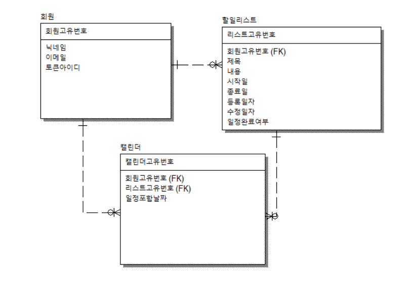

# todolist_front
## TODO 앱 화면
**개발기간** : 2024-12-10 ~ 2024-12-20

### 📢프로젝트 소개
- 기본적인 TODO 어플리케이션의 화면입니다.
- 소셜 API를 사용하여 로그인 기능을 구현하였습니다.
- 캘린더를 활용하여 해당날짜를 선택하여 일정을 확인하고
  추가,수정,삭제 할 수 있습니다.

### 프로젝트 실행방법
-- 터미널 
mysql -u root -p
-- mysql todolist_db 데이터베이스 생성
CREATE DATABASE todolist_db;
-- todo 계정 생성
CREATE USER 'todo'@'localhost' IDENTIFIED BY 'todo';

###데이터베이스 구성

